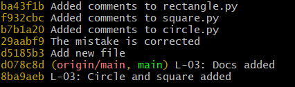

# Math formulas
## Area
- Circle: S = πR²
- Rectangle: S = ab
- Square: S = a²
- Triangle: S=ah/2
## Perimeter
- Circle: P = 2πR
- Rectangle: P = 2a + 2b
- Square: P = 4a
- Triangle: S=a+b+c

# Geometric_Lib
## Использование
Набор фунций для вычисления площадей и периметров базовых геометрических фигур: круга, квадрата, прямоугольника и треугольника. 
## Функции
### area
#### Площадь круга
*Описание:*

Возвращает произведение квадрата десятичного числа и константы math.pi.
           
*Параметр:*
              
r (float) : десятичное число

*Возвращаемое значение:*

area (float): площадь круга с радиусом r

*Пример вызова:*
```Python
area(5.1)
```
*Ответ:* 16.022122533307943 
#### Площадь квадрата
*Описание:*

Возвращает квадрат десятичного числа.
           
*Параметр:*
              
a (float) : десятичное число

*Возвращаемое значение:*

area (float): площадь квадрата со стороной a

*Пример вызова:*
```Python
area(5.1)
```
*Ответ:* 26.009999999999998
#### Площадь прямоугольника
*Описание:*

Возвращает произведение двух десятичных чисел
           
*Параметр:*
              
a (float) : десятичное число

b (float) : десятичное число

*Возвращаемое значение:*

area (float): площадь прямоугольника со сторонами a и b

*Пример вызова:*
```Python
area(5.1, 5.2)
```
*Ответ:* 26.52 
#### Площадь треугольника
*Описание:*

Возвращает полупроизведение двух десятичных чисел.
           
*Параметр:*
              
a (float) : десятичное число

h (float) : десятичное число

*Возвращаемое значение:*

area (float): площадь треугольника со стороной a и высотой h

*Пример вызова:*
```Python
area(5.1, 2.5)
```
*Ответ:* 6.375

### perimeter
#### Длина окружности
*Описание:*

Возвращает удвоенное произведение десятичного числа и константы math.pi.
           
*Параметр:*
              
r (float) : десятичное число

*Возвращаемое значение:*

perimeter (float): длина окружности радиусa r

*Пример вызова:*
```Python
perimeter(5.1)
```
*Ответ:* 32.044245066615886
#### Периметр квадрата
*Описание:*

Возвращает учетверённое десятичное число.
           
*Параметр:*
              
a (float) : десятичное число

*Возвращаемое значение:*

perimeter (float): периметр квадрата со стороной a

*Пример вызова:*
```Python
perimeter(5.1)
```
*Ответ:* 20.4
#### Периметр прямоугольника
*Описание:*

Возвращает удвоенную сумму двух десятичных чисел.
           
*Параметры:*
              
a (float) : десятичное число

b (float) : десятичное число

*Возвращаемое значение:*

perimeter (float): периметр прямоугольника со сторонами a и b

*Пример вызова:*
```Python
perimeter(5.1, 5.2)
```
*Ответ:* 20.6
#### Периметр треугольника
*Описание:*

Возвращает сумму трёх десятичных чисел.
           
*Параметры:*
              
a (float) : десятичное число

b (float) : десятичное число
                               
c (float) : десятичное число

*Возвращаемое значение:*

perimeter (float): периметр треугольника со сторонами a, b и c

*Пример вызова:*
```Python
perimeter(5.1, 2.5, 7.1)
```
*Ответ:* 14.7

## История коммитов
